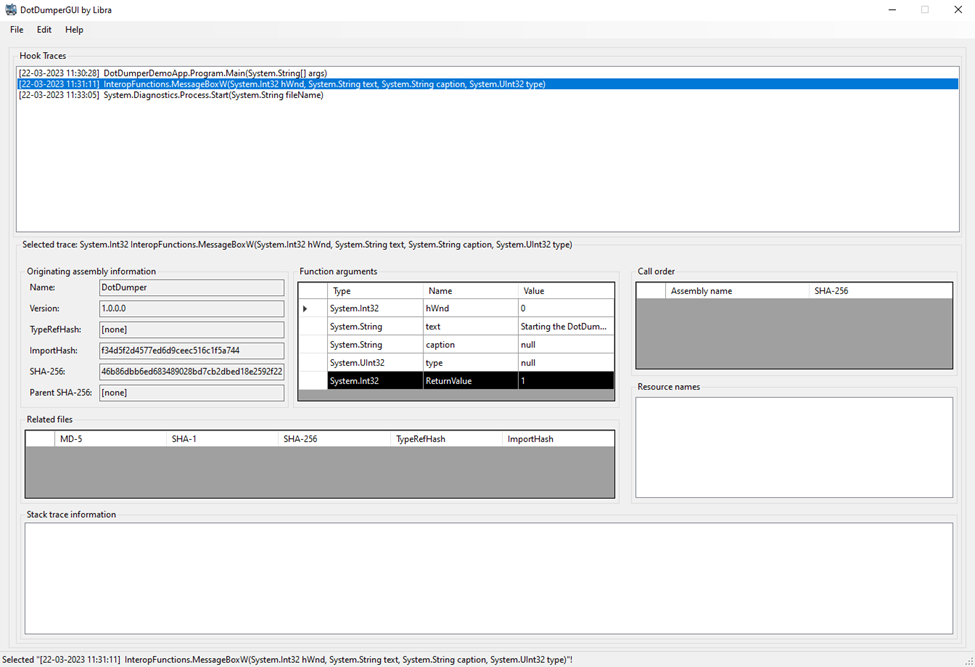
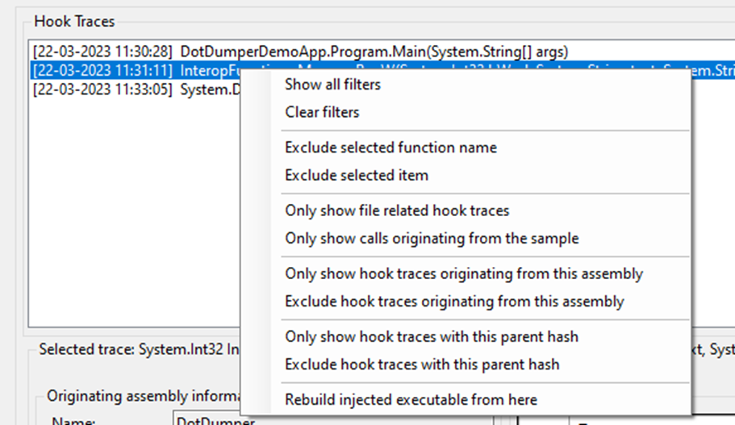
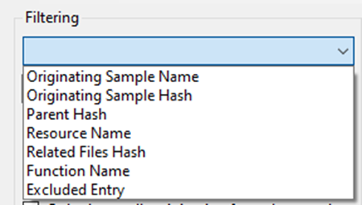

# DotDumperGUI
A graphical user interface (GUI) for [DotDumper](https://github.com/advanced-threat-research/DotDumper), first released at [Black Hat Asia 2023's Arsenal](https://www.blackhat.com/asia-23/arsenal/schedule/index.html#dotdumper-automatically-unpacking-dotnet-based-malware-31071).

The goal and purpose of DotDumperGUI is to provide an easy-to-use and intuitive way for analysts to open the DotDumper JSON output, and filter through it, based on custom filters. These filters, as well as the filtered results, can be saved for later reuse. The feature-rich context menus in all parts of the program allow for an intuitive and easy-to-use user experience, all while using a DotNet Core based Windows Forms application.

The main UI is given below.

Note how the information for each trace is shown in the respective data fields within the UI, making it easy for an analyst to spot key details.

When selecting a trace and right-clicking on it, the rich context menu will pop-up, allowing one to easily create a filter from the selected trace.

Additionally, one can also create filters within the dedicated menu, which can be kept open along side the main UI for easy access.

Note that conflicting filters can be created, using any of the variety of filters within the selectable options, as can be seen below.

